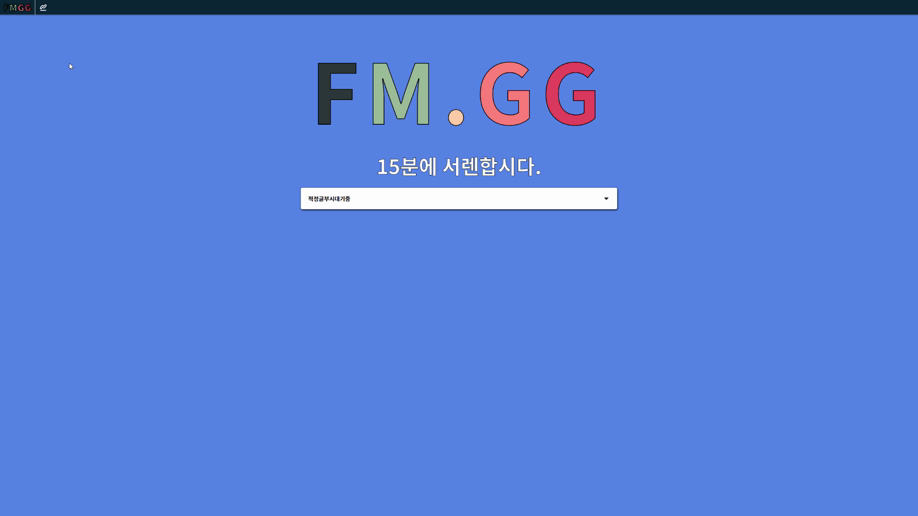
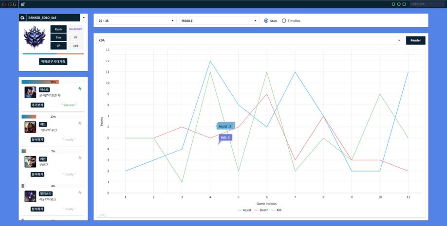

# FM.GG(15서렌)

## 개발 목표

- `Riot Games Api`를 통한 리그오브레전드 정보 사이트 만들기
- http://ec2-15-164-102-54.ap-northeast-2.compute.amazonaws.com

## Tech Stack

| Frontend | Backend | Database | Hosting |
|:--------:|:--------:|:-------:|:-------:|
| `React` | `Node.js` | | `AWS EC2`
| `Redux` | `Express.js` |  |
| `Redux-Saga` |  | |
|`React-Router`|
| `Styled-Components`|
| `Webpack`|
| `Babel`|

## 활용 가능한 데이터 `(API_KEY Required.)`

### `SUMMONER-V4`

> https://kr.api.riotgames.com/lol/summoner/v4/summoners/by-name/{summonerName}

- 소환사 닉네임 - `name`
- 소환사 레벨 - `summonerLevel`
- 소환사 정보 갱신 시각 - `revisionDate`
- 암호화된 소환사 아이디 - `id`
- 암호화된 계정 아이디 - `accountId`

### `CHAMPION-MASTERY-V4`

> https://kr.api.riotgames.com/lol/champion-mastery/v4/champion-masteries/by-summoner/{encryptedSummonerId}

- 챔피언 아이디 - `championId`
- 챔피언 숙련도 레벨 - `championLevel`
- 챔피언 숙련도 점수 - `championPoints`
- 챔피언 남은 숙련도 점수 - `championPointsUntilNextLevel` (5레벨에 0 고정)
- 마지막 플레이 시각 - `lastPlayTime`
- 챔피언 레벨 토큰 개수 - `tokensEarned` (5레벨 이후를 위한 토큰)
- 마지막 챔피언 레벨 이후의 숙련도 점수 - `championPointsSinceLastLevel`
- 소환사 아이디 - `summonerId` (암호화)

### `CHAMPION-V3`

> https://kr.api.riotgames.com/lol/platform/v3/champion-rotations

- 금주의 무료 챔피언 - `freeChampionIds`
- 뉴비를 위한 무료 챔피언 - `freeChampionIdsForNewPlayers`

### `LEAGUE-V4`

> https://kr.api.riotgames.com/lol/league/v4/entries/by-summoner/{encryptedSummonerId}?api_key={api_key}

- 게임 종류 - `queueType`
- 소환사이름 - `summonerName`
- 승리 - `wins`
- 패배 - `losses`
- 티어 - `tier`
- 랭크 - `rank`
- 리그 점수 - `leaguePoints`

### `MATCH-V4`

> https://kr.api.riotgames.com/lol/match/v4/matchlists/by-account/{encryptedAccountId}&api_key={api_key}

- 라인 - `lane`
- 게임아이디 - `gameId`
- 챔피언 - `champion`
- 플랫폼아이디 - `platformId`
- 게임시각 - `timestamp`
- 게임타입 - `queue`
- 역할 - `role`
- 시즌 - `season`

## 개발 이미지

| HOME (개발완료) |
|:--------:|
||

| SUMMONER LEAGUE (개발중) |
|:--------:|
||

## 개발 히스토리

- 2019-11-07
  
  - URL 파라미터를 통한 접근도 가능하도록 설정
  
  - 승률 게이지는 양쪽에서 팽창하는 애니메이션 적용
    > Styled-Components를 통해서 작업을 하는데 드롭다운 리스트 변경을 함에도 불구하고 애니메이션이 새롭게 재적용 되지 않는 문제가 있었다. 컴포넌트에 `Key` 속성을 할당하면서 애니메이션이 재 적용되었음.
  - 상단 드롭다운을 통해 진행한 게임종류에 따른 리그정보 확인가능

- 2019-11-11

  - [`Kayn`](https://github.com/cnguy/kayn) 라이브러리 도입 결정

    - 요청 트래픽 자동 조정
  
    - 개발 코스트 최소화

  - 최근 게임 정보 호출을 통한 플레이 빈도가 높은 챔피언 확인
  
    - > 유저는 자신이 빈도높게 활용하는 챔피언을 통한 플레이가 어떻게 변화하고 있는지 확인하고 싶을 것.

- 2019-11-13

  - 모스트 픽으로 진행된 게임데이터 추출 프로세스 구축

    - Step.1 : 최근에 진행된 100 게임 확인 및 `championId` 카운트.
  
    - Step.2 : 뷰를 모스트 픽으로 렌더링하고 버튼 클릭시 해당 `championId`로 인게임 데이터 쿼리.
 
    - Step.3 : `Promise.all` 메소드를 통해 모든 요청이 완료 되었을때 일제히 응답.

  - 커피 머신 배송와서 이거 먼저 연구할 예정

- 2019-11-20

  - 인게임 데이터를 기반으로 내부 데이터 쿼리 및 시각화 기능 구현

    - Step.1 : 게임 길이와 플레이한 라인을 결정.
  
      - > 게임 길이와 라인에 따라서 인게임 데이터 수치가 달라지기 때문에 게임 길이는 10분 단위로 산정하고 라인별 데이터로 필터링하였음.

    - Step.2 : 게임 데이터 키 결정 및 차트([`AmChart4`](https://www.amcharts.com/)) 렌더링

      - > 필터링된 데이터는 구조상 규칙적이므로 Y축은 게임 내 값을, X축은 각각의 게임을 매핑함. 오른쪽으로 갈 수록 최근의 게임임.

  - 배포는 터지는 오류들좀 잡고 나서...

- 2019-11-24

  - 나머지 api 통신처리도 kayn 라이브러리를 이용하도록 통합.

  - 소환사 검색에 실패했을 경우 홈 경로로 이동.