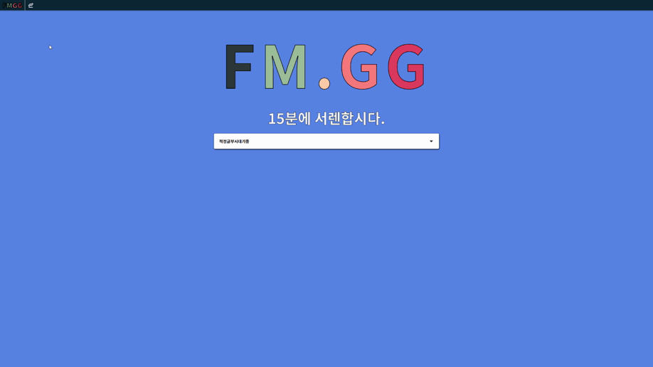

# FM.GG(15서렌)

## 개발 목표

- `Riot Games Api`를 통한 리그오브레전드 정보 사이트 만들기
- http://ec2-15-164-102-54.ap-northeast-2.compute.amazonaws.com

## Tech Stack

| Frontend | Backend | Database | Hosting |
|:--------:|:--------:|:-------:|:-------:|
| `React` | `Node.js` | | `AWS EC2`
| `Redux` | `Express.js` |  |
| `Redux-Saga` |  | |
|`React-Router`|
| `Styled-Components`|
| `Webpack`|
| `Babel`|

## 활용 가능한 데이터 `(API_KEY Required.)`

### `SUMMONER-V4`

> https://kr.api.riotgames.com/lol/summoner/v4/summoners/by-name/{summonerName}

- 소환사 닉네임 - `name`
- 소환사 레벨 - `summonerLevel`
- 소환사 정보 갱신 시각 - `revisionDate`
- 암호화된 소환사 아이디 - `id`
- 암호화된 계정 아이디 - `accountId`

### `CHAMPION-MASTERY-V4`

> https://kr.api.riotgames.com/lol/champion-mastery/v4/champion-masteries/by-summoner/{encryptedSummonerId}

- 챔피언 아이디 - `championId`
- 챔피언 숙련도 레벨 - `championLevel`
- 챔피언 숙련도 점수 - `championPoints`
- 챔피언 남은 숙련도 점수 - `championPointsUntilNextLevel` (5레벨에 0 고정)
- 마지막 플레이 시각 - `lastPlayTime`
- 챔피언 레벨 토큰 개수 - `tokensEarned` (5레벨 이후를 위한 토큰)
- 마지막 챔피언 레벨 이후의 숙련도 점수 - `championPointsSinceLastLevel`
- 소환사 아이디 - `summonerId` (암호화)

### `CHAMPION-V3`

> https://kr.api.riotgames.com/lol/platform/v3/champion-rotations

- 금주의 무료 챔피언 - `freeChampionIds`
- 뉴비를 위한 무료 챔피언 - `freeChampionIdsForNewPlayers`

### `LEAGUE-V4`

> https://kr.api.riotgames.com/lol/league/v4/entries/by-summoner/{encryptedSummonerId}?api_key={api_key}

- 게임 종류 - `queueType`
- 소환사이름 - `summonerName`
- 승리 - `wins`
- 패배 - `losses`
- 티어 - `tier`
- 랭크 - `rank`
- 리그 점수 - `leaguePoints`

### 

## 개발 이미지

| FMGG HOME |
|:--------:|
||